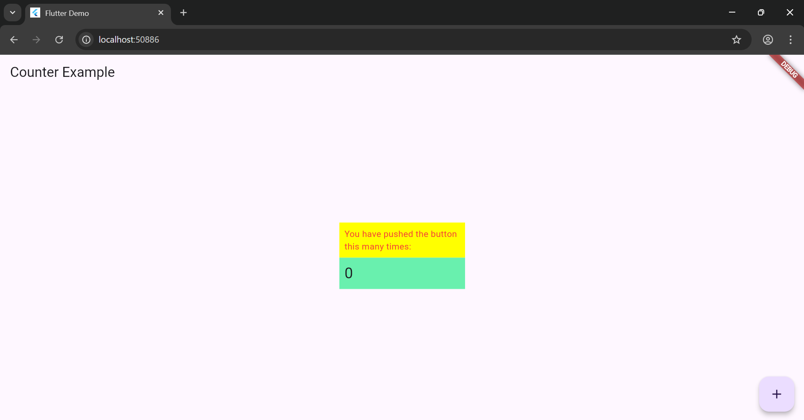

# Pemrograman Mobile - Pertemuan 7

NIM : 2341720244

NAMA : Firdaus Yuli Darmawan

===  Tugas Praktikum  ===

1. Selesaikan Praktikum tersebut, lalu dokumentasikan dan push ke repository Anda berupa screenshot hasil pekerjaan beserta penjelasannya di file README.md!
2. Jelaskan maksud dari langkah 2 pada praktikum tersebut!
3. Jelaskan maksud dari langkah 5 pada praktikum tersebut!
4. Pada langkah 6 terdapat dua widget yang ditambahkan, jelaskan fungsi dan perbedaannya!
5. Jelaskan maksud dari tiap parameter yang ada di dalam plugin auto_size_text berdasarkan tautan pada dokumentasi ini !
6. Kumpulkan laporan praktikum Anda berupa link repository GitHub kepada dosen!

Hasil Akhir Praktikum:



Langkah 2 pada praktikum diatas menjelaskan proses menambahkan plugin (package) bernama auto_size_text ke dalam proyek Flutter. Perintah yang digunakan berfungsi untuk menginstal dan menambahkan dependency auto_size_text secara otomatis ke dalam file pubspec.yaml. Langkah 2 dalam praktikum ini berarti kita mengintegrasikan plugin auto_size_text ke proyek Flutter, supaya kita bisa menggunakan widget AutoSizeText yang mampu menyesuaikan ukuran teks secara otomatis sesuai ruang yang tersedia di layar.

Langkah 5 pada praktikum diatas menjelaskan tentang pembuatan variabel text dan parameter pada constructor di dalam class RedTextWidget. Tujuan dari langkah ini, agar widget RedTextWidget bisa menerima teks dari luar (saat dipanggil di widget lain). Dengan kata lain, langkah ini membuat widget projek menjadi lebih fleksibel dan bisa digunakan ulang dengan berbagai teks.

Pada Langkah 6, terdapat dua widget Container yang ditambahkan ke dalam file main.dart.
Keduanya digunakan untuk menampilkan teks dengan gaya dan fungsi yang berbeda. Pada widget pertama, berfungsi untuk menampilkan teks menggunakan widget khusus bernama RedTextWidget. RedTextWidget adalah widget kustom yang sebelumnya telah kita buat sendiri yang  digunakan untuk menampilkan teks berwarna merah dan dapat menyesuaikan ukuran teks menggunakan AutoSizeText. Sedangkan pada widget kedua, digunakan untuk menampilkan teks menggunakan widget bawaan Flutter, yaitu Text. Widget ini tidak memiliki kemampuan otomatis menyesuaikan ukuran font seperti AutoSizeText.

## 🧩 Penjelasan Parameter Plugin `auto_size_text`

| Parameter | Tipe Data | Deskripsi | Contoh Penggunaan |
|------------|------------|-------------|------------------|
| **`text`** | `String` | Isi teks yang akan ditampilkan. | `'Hello Flutter!'` |
| **`style`** | `TextStyle` | Mengatur tampilan teks seperti warna, ukuran, ketebalan, dan font. | `TextStyle(color: Colors.red, fontSize: 14)` |
| **`maxLines`** | `int` | Jumlah **baris maksimal** yang boleh digunakan. Jika lebih, teks akan dipotong sesuai `overflow`. | `maxLines: 2` |
| **`minFontSize`** | `double` | Ukuran **terkecil** yang boleh digunakan saat teks dikecilkan agar tetap muat di area. | `minFontSize: 10` |
| **`maxFontSize`** | `double` | Ukuran **terbesar** yang boleh digunakan untuk teks (opsional). | `maxFontSize: 20` |
| **`overflow`** | `TextOverflow` | Menentukan **cara menangani teks yang terlalu panjang**. | `TextOverflow.ellipsis` → menampilkan “...” |
| **`textAlign`** | `TextAlign` | Mengatur **perataan teks**: kiri, kanan, tengah, atau rata kanan-kiri. | `TextAlign.center` |
| **`stepGranularity`** | `double` | Mengatur **tingkat penurunan ukuran font** setiap kali teks dikecilkan. Nilai kecil = lebih presisi. | `stepGranularity: 1` |
| **`presetFontSizes`** | `List<double>` | Daftar ukuran font yang akan dicoba secara berurutan. Jika diset, `minFontSize` diabaikan. | `presetFontSizes: [20, 18, 16, 14]` |
| **`group`** | `AutoSizeGroup` | Menyinkronkan ukuran font beberapa `AutoSizeText` agar **semua memiliki ukuran teks sama**. | `group: myGroup` |
| **`wrapWords`** | `bool` | Mengatur apakah kata panjang boleh dipecah ke baris baru. | `wrapWords: true` |
| **`softWrap`** | `bool` | Menentukan apakah teks otomatis turun ke baris baru jika tidak muat. | `softWrap: true` |
| **`textDirection`** | `TextDirection` | Mengatur arah penulisan teks (kiri ke kanan atau kanan ke kiri). | `textDirection: TextDirection.ltr` |
| **`overflowReplacement`** | `Widget?` | Widget pengganti yang akan muncul jika teks tidak muat sama sekali. | `overflowReplacement: Text('Teks terlalu panjang!')` |

---

### 💡 Contoh Implementasi

```dart
Container(
  width: 100,
  color: Colors.yellowAccent,
  child: const AutoSizeText(
    'Teks ini akan mengecil otomatis agar muat!',
    style: TextStyle(fontSize: 24),
    maxLines: 2,
    minFontSize: 10,
    overflow: TextOverflow.ellipsis,
  ),
);