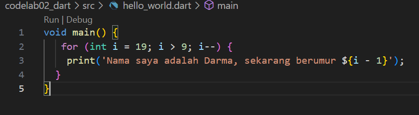
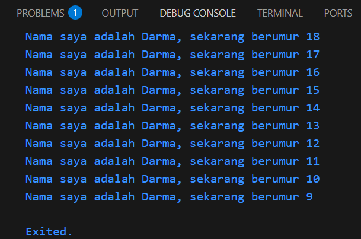
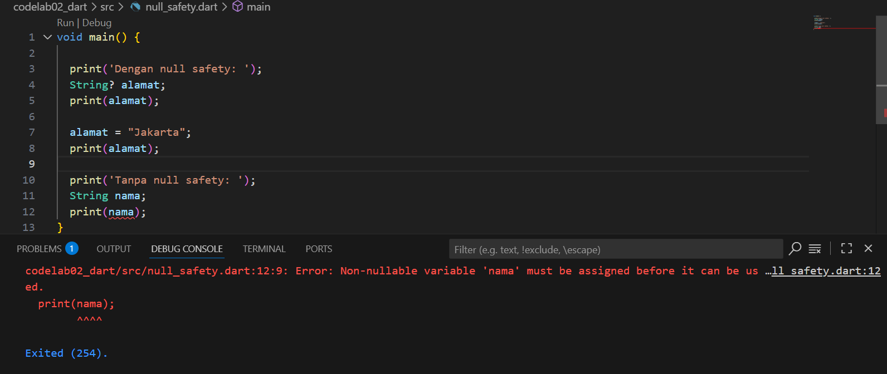
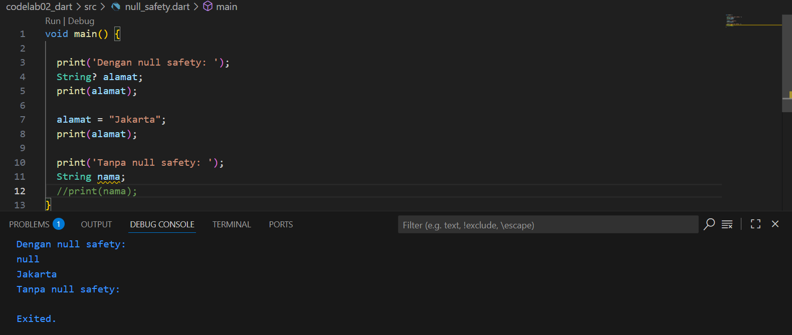
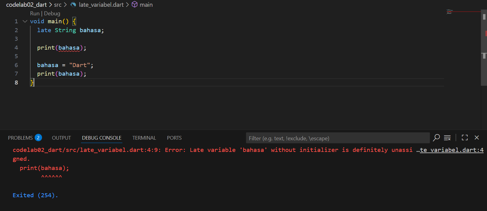
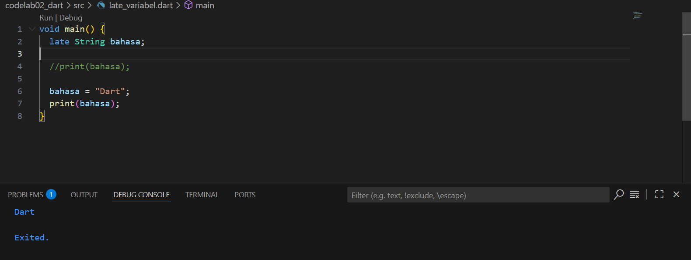

# Pemrograman Mobile - Pertemuan 1
Project Hello Wolrd

NIM : 2341720244

NAMA : Firdaus Yuli Darmawan

===  Tugas Praktikum  ===
1. Modifikasi program:

Kode Program:

Tampilan Output:

2. Flutter adalah sebuah framework untuk membangun aplikasi baik itu mobile, web, ataupun desktop. Sedangkan dart adalah bahasa pemrograman utama yang digunakan Flutter. Hal ini berarti kita harus memahami logika dasar dari pemrograman dart untuk dapat menggunakan flutter sebagai eksekusi dari aplikasi yang akan kita buat. Flutter tidak punya “bahasa sendiri”, ia sepenuhnya ditulis dan dijalankan dengan Dart. Semua widget, state management, dan logika aplikasi ditulis dalam sintaks Dart. Kalau tidak paham Dart, kita hanya akan menghafal kode tanpa benar-benar mengerti bagaimana cara kerjanya.

3. ===  Rangkuman Materi  ===

a. Pengertian Dart

Bahasa Dart adalah inti dari framework Flutter. Memahami Dart adalah dasar untuk bekerja dengan Flutter. Pengembang perlu mengetahui asal-usul bahasa Dart, bagaimana komunitas mengerjakannya, kelebihannya, dan mengapa itu adalah bahasa pemrograman yang dipilih untuk Flutter.

b. Memulai dengan Dart

Dart bertujuan untuk menggabungkan kelebihan-kelebihan dari sebagian besar bahasa tingkat tinggi dengan fitur-fitur bahasa pemrograman terkini, antara lain seperti; Productive tooling, Garbage collection, Type annotations (opsional), Statically typed, dan Portability.

c. Cara Kerja Dart

Kode Dart dapat dieksekusi pada lingkungan yang mendukung bahasa Dart. Lingkungan yang mendukung bahasa Dart perlu memperhatikan fitur-fitur penting seperti Runtime systems, Dart core libraries, dan Garbage collectors. Eksekusi kode Dart dapat beroperasi dalam dua mode — kompilasi Just-In-Time (JIT) atau Kompilasi Ahead-Of-Time (AOT). 

d. Pengenalan Struktur Bahasa Dart

    Sintaks Dart

        1. Mirip dengan C, JavaScript, dan bahasa tingkat tinggi lainnya.

        2. Mendukung variabel, tipe bawaan (built-in types), control flow, dan function.

    Object-Oriented Programming (OOP)

        1. Dart berbasis OOP dengan konsep class dan object.

        2. Mendukung prinsip encapsulation, inheritance, composition, abstraction, polymorphism.

        3. Semua data di Dart adalah object (tidak ada tipe primitif seperti di Java).

    Operator di Dart

        1. Operator sebenarnya adalah method khusus dalam class.

        2. Contoh: x == y sama dengan x.==(y).

        3. Operator bisa dioverride sesuai kebutuhan.

    Arithmetic Operators

        1. +, -, *, / (hasil double), ~/ (pembagian integer), %, unary -.

        2. Shortcut operators: +=, -=, *=, /=, ~/=.

    Increment & Decrement

        1. ++var / var++ → tambah 1.

        2. --var / var-- → kurangi 1.

        3. Berguna dalam perulangan.

    Equality & Relational Operators

        1. ==, !=, >, <, >=, <=.

        2. == membandingkan isi, bukan alamat memori (beda dengan Java).

        3. Tidak ada === (seperti di JavaScript) karena Dart sudah type-safe.

    Logical Operators

        1. ! (NOT), || (OR), && (AND).

        2. Digunakan pada boolean (bool).

4. Null Safety adalah fitur di Dart yang memastikan variabel tidak bisa bernilai null kecuali secara eksplisit diizinkan. Tujuan dari fitur ini agar error null reference (null pointer) bisa dicegah sejak compile-time. Sedangkan late digunakan saat kita menunda inisialisasi variabel tetapi ingin Dart tahu bahwa variabel pasti akan diberi nilai sebelum digunakan. Hal ini berguna jika nilai variabel belum tersedia saat deklarasi, tapi pasti ada sebelum dipakai.

===  Contoh Penerapan  ===

a. Null Safety

b. Late Variabel

