# Pemrograman Mobile - Pertemuan 3

NIM : 2341720244

NAMA : Firdaus Yuli Darmawan

===  Tugas Praktikum  ===
1. Praktikum 1

Output:

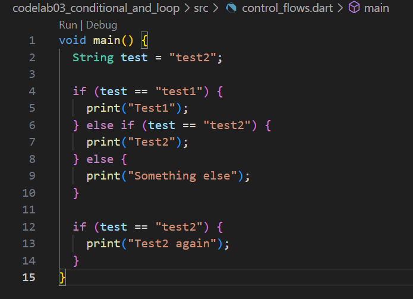

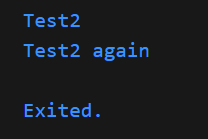

Program diatas merupakan implementasi dari cotrol flows dari dart. Program berjalan dengan  memeriksa isi dari variabel test melalui percabangan if /else. Jika isi dari variabel test yang telah dideklarasikan memenuhi kondisi salah satu percabangan yang telah ditulis dalam kode, program akan menghasilkan output sesuai dengan percabangan tersebut. Dalam konteks program diatas, program berhenti pada percabangan kedua yang memiliki kondisi test = Test2.

Output Modifikasi:

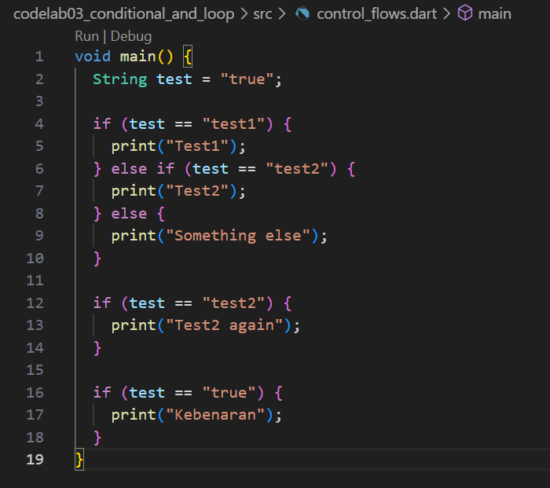

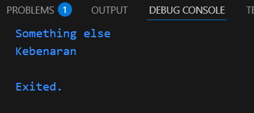

Modifikasi yang dilakukan mengubah isi dari variabel test menjadi "true". Hal ini berdampak pada output yang dihasilkan oleh program dimana output tersebut merupakan salah satu percabangan yang ditambahkan pada kode sebelumnya.

2. Praktikum 2

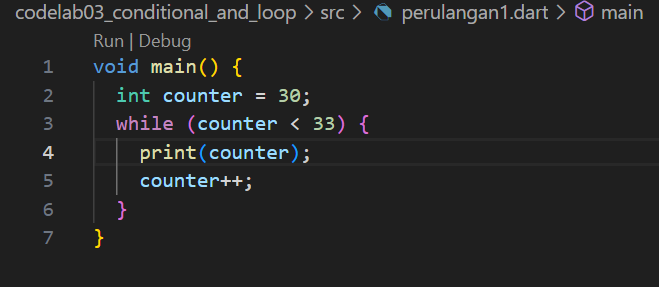

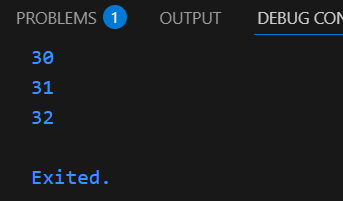

Kode program yang terdapat pada soal mengalami error pada eksekusinya. Hal ini disebabkan karena variabel counter yang merupakan kondisi pada perulangan while, belum dideklarasikan sehingga program tidak mengenali variabel tersebut. Untuk mengatasi error tersebut, variabel counter perlu dideklarasikan terlebih dahulu. Pada contoh diatas, variabel counter dideklarasikan dengan mengisi nilai 30 pada variabelnya sehingga menghasilkan output seperti gambar diatas.

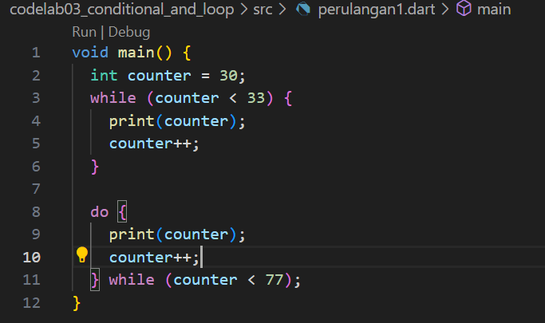

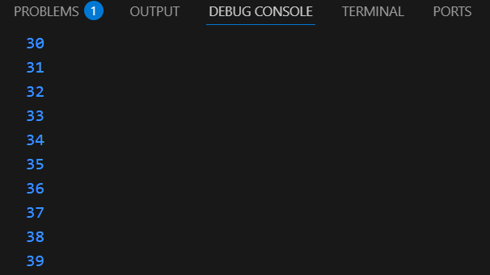

Modifikasi diatas menghasilkan output lanjutan dari perulangan sebelumnya. Program akan mencetak isi dari variabel counter hingga memenuhi kondisi dimana counter mencapai nilai 77.

3. Praktikum 3

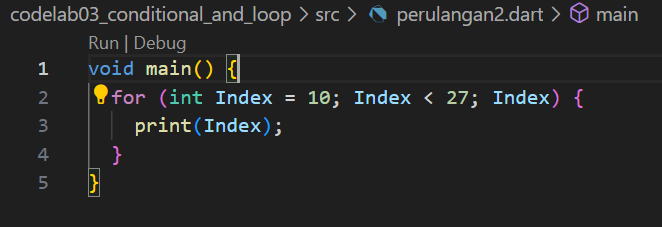

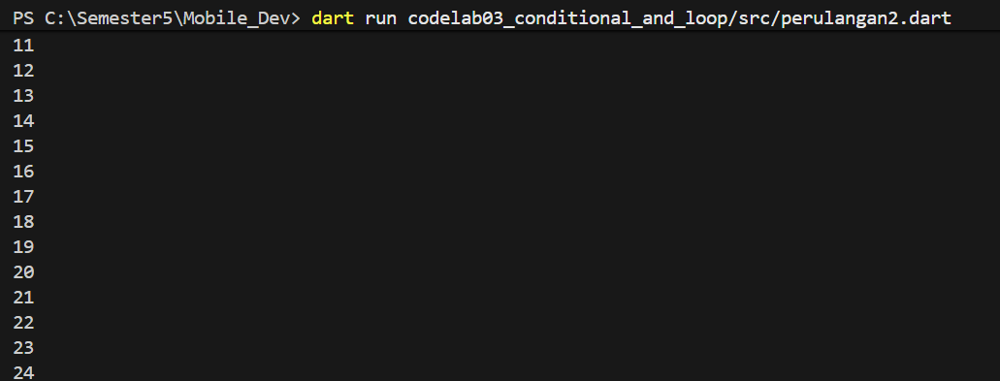

Berbeda dengan perulangan sebelumnya dimana variabel dideklarasikan sebelum memasuki perulangan tersebut, perulangan for dijalankan mendeklarasikan variabel didalam perulangan tersebut sebagai iterasi dari program.

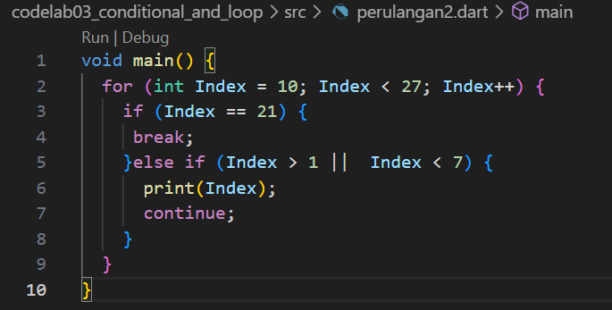

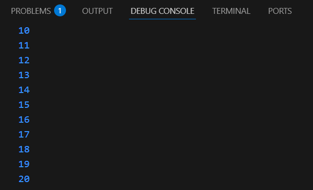

Modifikasi kode diatas menambahkan kondisi dimana program akan menghentikan perulangan secara paksa jika nilai Index telah mencapai 21. Hasilnya program hanya akan mencetak angka hingga 20 karena perulangan for telah dihentikan secara paksa pada nilai Index = 21.

4. Tugas Praktikum:

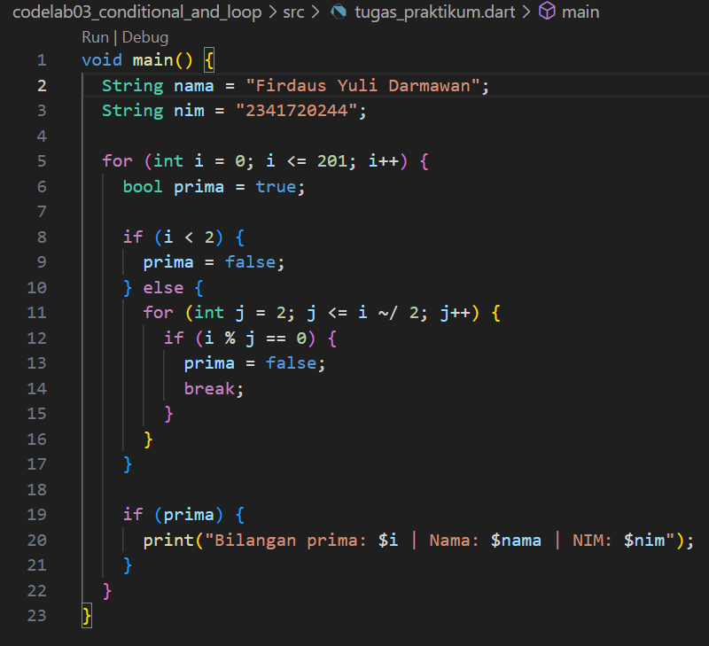

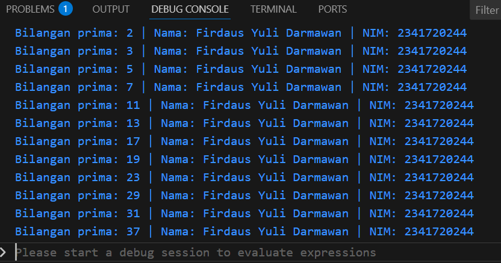