# Pemrograman Mobile - Pertemuan 4

NIM : 2341720244

NAMA : Firdaus Yuli Darmawan

===  Tugas Praktikum  ===
1. Praktikum 1

Kode Program:

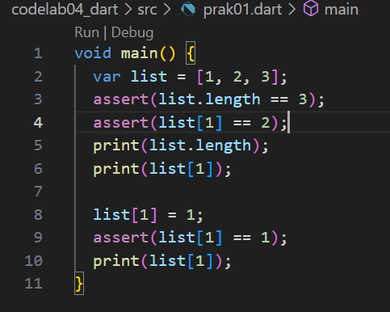

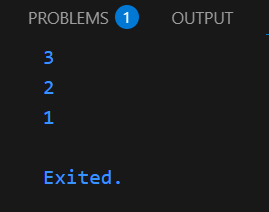

Program diatas merupakan implementasi dari tipe data list yang menyimpan beberapa nilai dalam 1 variabel. Pada saat kode dijalankan, program akan mencetak semua nilai yang dimiliki oleh var list yang telah dideklarasikan.

Kode Modifikasi:

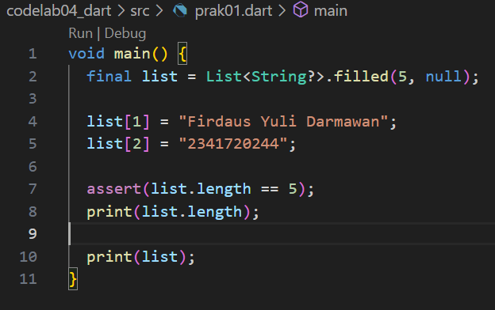

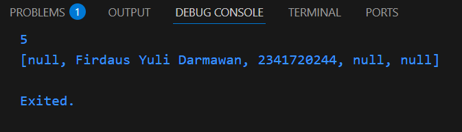

Modifikasi yang dilakukan mengubah variabel var menjadi final dengan panjang list sebanyak 5 index dan dengan nilai default null. pada index ke-1 dan ke-2, variabel tersebut diisi dengan nama dan nim yang kemudian akan dicetak melalui pada terminal output.

2. Praktikum 

Kode Program:

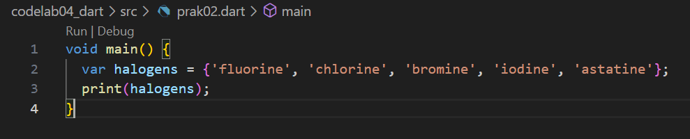

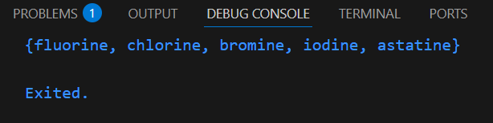

Program diatas mendeklarasikan sebuah set di dalam dart berisi 5 elemen unik di dalamnya. Elemen unik di atas berarti elemen yang berada di dalam set halogens tidak boleh duplikat/sama serta tidak menjamin urutan di dalamnya.

Kode Modifikasi:

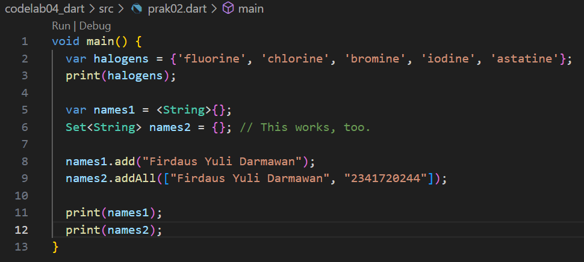

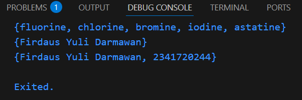

Modifikasi dari program menambahkan 2 variabel set kosong yang diisi dengan fungsi .add() dan .addAll(). kedua fungsi ini menambahkan nilai pada variabel set kemudian mencetak nilainya pada terminal output.

3. Praktikum 3

Kode Program:

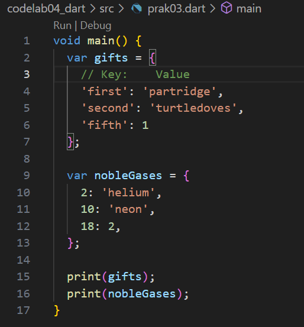

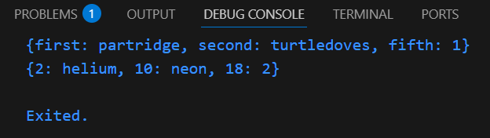

Program di atas mendefinisikan dua buah map di Dart, yaitu gifts dan nobleGases. Map gifts menggunakan string sebagai kunci ('first', 'second', dan 'fifth'). Setiap kunci dipasangkan dengan sebuah nilai, misalnya 'first' dipasangkan dengan 'partridge', 'second' dengan 'turtledoves', dan 'fifth' dengan angka 1. Hal ini menunjukkan bahwa dalam sebuah map, nilai yang disimpan bisa memiliki tipe data berbeda, seperti string dan integer sekaligus. Map nobleGases menggunakan angka sebagai kunci (2, 10, dan 18). Sama seperti map pertama, setiap kunci memiliki nilai pasangan, misalnya 2 dengan 'helium', 10 dengan 'neon', dan 18 dengan angka 2. Ketika kedua map ini dicetak menggunakan print, hasil yang ditampilkan adalah isi map berupa pasangan kunci dan nilai.

Kode Modifikasi:

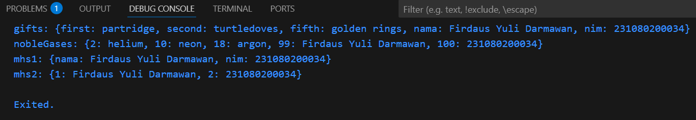

Kode diatas menunjukkan bahwa Map di Dart dapat menyimpan data dengan key string atau integer, dan kita bisa menambahkan pasangan key value baru kapan saja.

4. Praktikum 4

Kode Program:

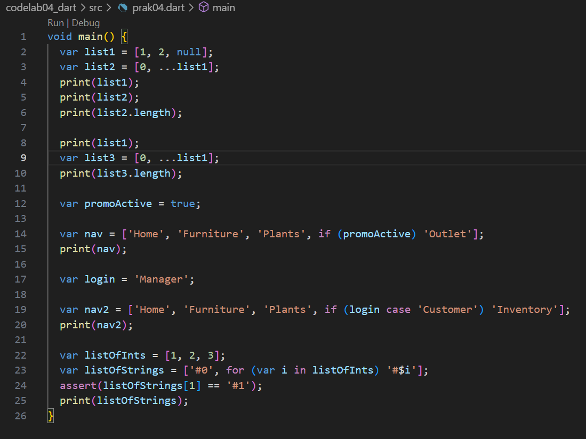

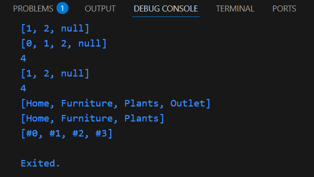

Pada praktikum ini dipelajari bagaimana koleksi di Dart seperti List, Set, dan Map dapat dimodifikasi menggunakan operator spread (...), kondisi if di dalam koleksi, serta collection for untuk membangun data secara dinamis. Intinya, fitur-fitur ini mempermudah penulisan kode agar lebih ringkas, fleksibel, dan mudah dipahami, misalnya menambahkan elemen berdasarkan kondisi tertentu atau hasil perulangan langsung ke dalam koleksi tanpa kode tambahan yang panjang.

5. Praktikum 5

Kode Program:

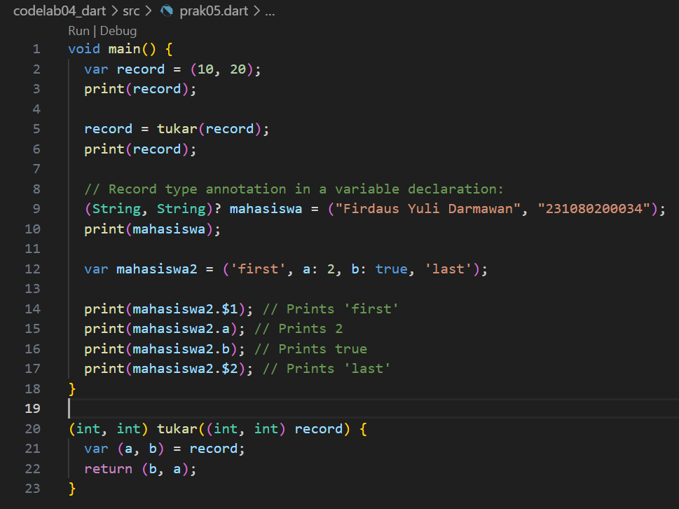

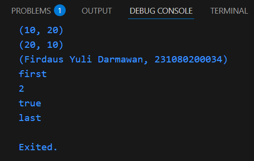

Inti dari praktikum di atas adalah mempelajari penggunaan record di Dart, yaitu struktur data baru yang dapat menyimpan beberapa nilai dengan tipe berbeda dalam satu variabel tanpa harus membuat class. Praktikum ini menunjukkan cara membuat record sederhana (10, 20) dan menukarnya menggunakan fungsi tukar, cara memberikan tipe anotasi record pada variabel seperti mahasiswa untuk menyimpan data nama dan NIM, serta cara menggunakan record dengan field bernama maupun posisi, misalnya mengakses elemen dengan $1, $2, atau nama field a dan b. Dengan demikian, record memudahkan pengelolaan data terstruktur secara ringkas, fleksibel, dan mudah diakses.

6. Tugas Praktikum:

| **Topik** | **Penjelasan Singkat** | **Contoh Sintaks** |
|-----------|-------------------------|---------------------|
| **Functions di Dart** | Blok kode untuk menjalankan tugas tertentu, bisa dipanggil berulang. | `int tambah(int a, int b) => a + b;` |
| **Positional Parameter** | Parameter wajib sesuai urutan. | `void greet(String name, int age)` |
| **Optional Positional Parameter** | Parameter opsional dengan `[]`. | `void greet(String name, [int? age])` |
| **Named Parameter** | Parameter menggunakan `{}` dengan nama, bisa `required` atau default value. | `void greet({required String name, int age = 0})` |
| **First-Class Functions** | Fungsi diperlakukan seperti objek: bisa disimpan, dikirim, dikembalikan. | `var f = print; f("Hello");` |
| **Anonymous Functions** | Fungsi tanpa nama, biasanya untuk callback. | `list.forEach((item) { print(item); });` |
| **Lexical Scope** | Variabel hanya bisa diakses dalam lingkup definisinya. | `var name = "Firdaus"; void hello() => print(name);` |
| **Lexical Closure** | Fungsi yang menangkap variabel dari scope luar meski scope selesai. | `counter(){int x=0; return (){x++; return x;};}` |
| **Return Multiple Values** | Mengembalikan banyak nilai dengan Record, List, atau Map. | `(String, int) getMhs()=>("Firdaus",123);` |